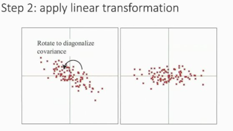
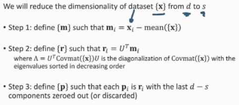

In PCA, the goal is to identify the eigenvectors (directions) that capture the most variance (eigenvalues) and use them to transform the data into a new space where the dimensions (principal components) are ordered by the amount of variance they explain.

The purpose of this is to reduce dimensionality in a way that minimizes the mean square error in the reconstructions

# Dimensinonality Reduction
Steps:
1. Subtract data to move data back to origin
    - Subtract every data point by the mean of that column (maybe group of columns with the whole dataset's mean) to move it to the origin
        - Basically standard scaling IMO
2. Apply linear transformation:
    - Below you can see a rotation to diagonalize the covariance
        - Multiplying by an orthogonal matrix
        
3. Drop vertical component to project onto x-axis:
    - This way they're basically all on the same line which is the same as what you saw in 10-605 t-SNE lectures

## Mathematical Principal Component Analysis

1. m_i = x_i - mean({x})
2. r_i = U.T * m_i
- Lambda = U.T * Covmat({max}) * U is diagonalization of Covmat({x}) with eigenvalues sorted in decreasing order.
3. Mean Square Error: 
- p_i is r_i with last d - s components zeroed out or discarded

## Multidimensional Scaling
Aims to not reconstruct but maintain the distances between points

